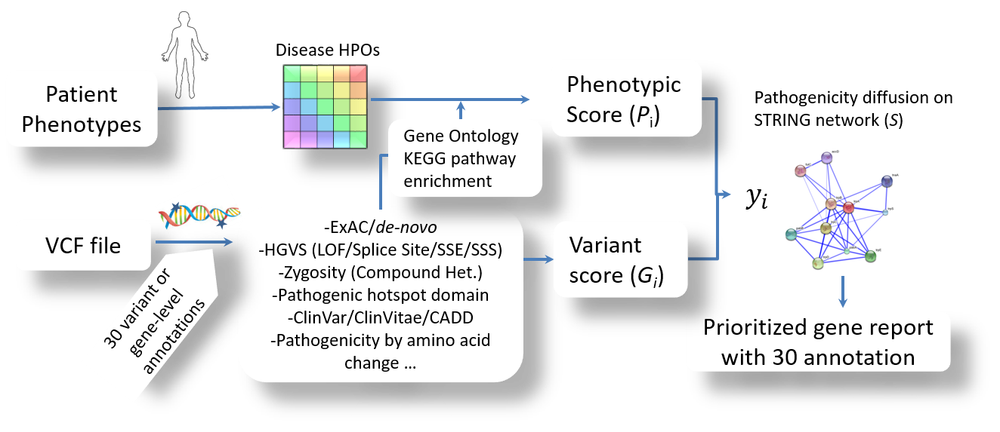

Table of Contents
=================

   * [<em>Divine</em> tutorial](#divine-tutorial)
      * [Introduction](#introduction)
         * [About this tutorial](#about-this-tutorial)
            * [Citation](#citation)
            * [Help](#help)
            * [License](#license)
      * [The Divine approach](#the-divine-approach)
      * [Installation](#installation)
      * [Examples](#examples)
            * [When patient phenotype/clinical features are only available](#when-patient-phenotypeclinical-features-are-only-available)
         * [When a patient VCF file is only available](#when-a-patient-vcf-file-is-only-available)
         * [When both patient phenotype/clinical features and VCF are available](#when-both-patient-phenotypeclinical-features-and-vcf-are-available)
   * [Reference](#reference)

# *Divine* tutorial

## Introduction
Divine (https://github.com/hwanglab/divine) is designed to make a molecular diagnosis in a daily routine with high-throughput whole exome sequencing data more efficient. Using both patient phenotypic information and genetic variants, Divine that integrates patients’ phenotype(s) and WES data with 30 prior biological knowledge (e.g., human phenotype ontology, gene ontology, pathway database, protein-protein interaction networks, etc.) to prioritize potential disease-causing genes.

### About this tutorial
In this tutorial, you will learn the basics of using Divine to analyze your WES samples. We will provide you with a step-by-step procedure that will annotate variants and suggest the order of mutated genes you pay attention more to facilitate a molecular diagnosis reporting.

Divine is developed at the *Hwang Lab* at Cleveland Clinic,

Taehyun Hwang, Ph.D.\
Quantitative Health Sciences\
Lerner Research Institute, Cleveland Clinic\
9211 Euclid Ave.\
Cleveland, OH 44106

#### Citation
Changjin Hong *et al*. [Divine: Prioritizing Genes for Rare Mendelian Disease in Whole Exome Sequencing Data](https://www.biorxiv.org/content/biorxiv/early/2018/08/21/396655.full.pdf)

#### Help
For support queries, please open a ticket, contact us at [https://github.com/hwanglab/divine/issues](https://github.com/hwanglab/divine/issues).

#### License
Divine is distributed freely under the GNU General Public License.

## The Divine approach
Divine is composed of five steps that together provide a complete framework to facilitate a molecular diagnosis for rare Mandaline disease. Given patient VCF file and HPO IDs that describes clinical features or disease symptoms, Divine computes (1) the patient phenotypic similarity to each condition, (2) annotates VCF file with 30 elements to assess pathogenic genetic risk on each variant, (3) expands prior knowledge for a new gene-to-disease association using Gene Ontology and KEGG pathway, (4) performs a heat diffusion of pathogenic score into a genetic function network, and (5) generates an annotated VCF table with prioritized potential disease-causing genes.


 
## Installation
Divine is tested under Linux, and it requires python 2.7.3 or higher installed in your system. Open ssh terminal to run the following. Assume that you want to install `divine` at `$HOME/apps`.

```bash
$ mkdir -p ~/apps #make a directory if not exist
$ cd ~/apps
$ git clone https://github.com/hwanglab/divine.git
$ cd divine
$ setup.py --install --update_db #it will take 1 to 2 hours
```
At the end of the installation, a message will instruct you to add environment variables in your bash script configuration file (e.g., $HOME/.bashrc or $HOME/.bash_profile). For example, open `~/.bashrc` using vi and then add the following lines at the end if not exist,
 
```bash
export DIVINE=$HOME/apps/divine
export PATH=$DIVINE/gcn/bin/prioritize:$HOME/.local/bin:$PATH
export PYTHONPATH=$DIVINE/python_libs/lib/python2.7/site-packages:$PYTHONPATH
export PYTHONPATH=$DIVINE:$PYTHONPATH
```
Relogin the terminal to apply the new bash configuration. Check if divine.py in the path,

```bash
$ divine.py --help
``` 
## Examples

#### Tested environment
We tested the examples in the Divine package under this Linux desktop,
    - python 2.7.5
    - Linux --- 3.10.0-693.21.1.el7.x86_64 #1 SMP Wed Mar 7 19:03:37 UTC 2018 x86_64 x86_64 x86_64 GNU/Linux
    - Quad-Core AMD Opteron(tm) Processor 238
    - 32 GB of RAM
    
#### When patient phenotype/clinical features are only available
1. Collect phenotypic description
Visit NIH Genetics Home Reference and let us extract some clinical features describing "Angelman Syndrome" (https://ghr.nlm.nih.gov/condition/angelman-syndrome). Check the file containing a set of phenotypic description in the example directory,
 
    ```bash
    $ cd $DIVINE/gcn/bin/prioritize/examples
    $ cat Angelman_Syndrome_desc.txt
    Drooling
    Nystagmus
    Muscular hypotonia
    Cognitive impairment
    Cerebral cortical atrophy
    Rod-cone dystrophy
    Sleep-wake cycle disturbance
    Hyperactivity
    Infantile spasms
    Exotropia
    Hypopigmentation of the skin
    Intellectual disability, progressive
    Scoliosis
    Flat occiput
    Broad-based gait
    Limb tremor
    Incoordination
    ```
1. Open a web browser and visit this website,
https://mseqdr.org/search_phenotype.php?hponame=&dbsource=HPO

1. Copy the list of descriptions above and paste it in the blank box under **Human Disease and Phenotype Search**. Click **HPO**

Browse a lookup table and select HPO ID for each term that matches at best.  

1. Check the following HPO ID file that we already collected,
    ```bash
    $ cat Angelman_Syndrome.hpo
    HP:0002307
    HP:0000639
    HP:0001252
    HP:0100543
    HP:0002120
    HP:0000510
    HP:0006979
    HP:0000752
    HP:0012469
    HP:0000577
    HP:0001010
    HP:0006887
    HP:0002650
    HP:0005469
    HP:0002136
    HP:0200085
    HP:0002311
    ```
1. At `$DIVINE/gcn/bin/prioritize/examples`, run this,
    ```bash
    $ ../divine.py -q ./Angelman_Syndrome.hpo -o ./Angelman_Syndrome
    ```
    The program takes the HPO file as an input and reports the result in the output directory (if not exist, it will create automatically).
    
1. Check the result files from the terminal directly (You can open the files from Excel in Windows or LibreOffice --calc in Linux)
    ```bash
    $ cd ./Angelman_Syndrome
    $ less -S hpo_to_diseases.tsv
    
    #disease_id     genes   score[funSimMax]
    OMIM:105830     UBE3A   0.000558541
    OMIM:616204     GRID2   0.000553722
    OMIM:609180     MPDU1   0.000549965
    ORPHANET:314918 ASPA    0.000540169
    OMIM:210000     C12ORF65        0.000533373
    OMIM:615924     BSCL2   0.000523755
    OMIM:604326     PPP2R2B 0.000522341
    OMIM:300957     THOC2   0.00051977
    OMIM:300958     DDX3X   0.00051977
    OMIM:606854     ADGRG1  0.000515699
    OMIM:311510     RAB39B  0.000514504
    ORPHANET:569    SCN1A,CACNA1A,ATP1A2,PRRT2      0.00051276
    :
    ```
    - disease_ID: OMIM, ORPHANET, or DECIPHER disease ID
    - genes: gene symbol
    - score[FunSimMax]: patient phenotype matching score to the disease
    
### When a patient VCF file is only available
Convert proband WES FASTQ files to a VCF file using GATK. Refer to [GATK Best practice](https://software.broadinstitute.org/gatk/best-practices/workflow?id=11145). For demonstration, we include a sample VCF file in the example folder ($DIVINE/gcn/bin/prioritize/examples) which is publicly available. Note that the VCF file is derived from a patient with 'Pfeiffer Syndrome'.

1. Change to the example directory and run Divine on the VCF file,
    ```bash
    $ cd $DIVINE/gcn/bin/prioritize/examples
    $ ../divine.py -v ./Pfeiffer.vcf -o ./Pfeiffer_noHpo
    ```
1. It provides only VCF. As a default, Divine solely focuses on variants in exonic regions (coding and 3'/5UTR) with 20bp flanking. A user can specify an option for common filters (e.g., minimum MAF cutoff for 1000 genome database, ESP, and ExAC, HGMD, a minimum read depth for confident variant calls, and genomic location to include/exclude in the annotation process). Refer to `$DIVINE/gcn/conf/filterconf.txt`to customize the default parameters.

### When both patient phenotype/clinical features and VCF are available
Consider a case where both HPO and VCF file are available. We have WES VCF file, `MillerSyndrome.vcf` along with a query HPO file `MillerSyndrome.vcf`. The VCF file contains 2,280,127 variants. 33 HPO IDs are included in the HPO file. It may take up to 20 to 30 min to finish the annotation process. 
1. Run this,
    ```bash
    $ cd $DIVINE/gcn/bin/prioritize/examples
    $ ../divine.py -q ./MillerSyndrome.hpo -v ./MillerSyndrome.vcf -o ./MillerSyndrome
    ```

1. The job takes a while since it annotates variants with 30 databases or features. Check the output files in the output directory (`./MillerSyndrome`)

1. Gene ranking by the Divine method
    ```bash
    $ less -S gene_rank.tsv
    #gene   predicted_score seed_score      gt_dmg_score    pheno_score     contain_known_pathogenic
    DHODH   0.0176147       7.1661e-05      0.0133057       0.0211746       NA
    WNT9B   0.00765901      3.0259e-05      0.00705979      0.0169397       NA
    WNT11   0.00534277      2.04658e-05     0.00478034      0.0169397       NA
    EFTUD2  0.00418035      1.67274e-05     0.00553851      0.0119754       NA
    FN1     0.00357255      1.40792e-05     0.00590873      0.00945812      NA
    TRPV4   0.00304139      1.20297e-05     0.0042796       0.0111573       NA
    :
    ```
    - gene: gene symbol
    - predicted_score: finalized score after heat diffusion
    - seed_score: a score after combining both phenotype matching score and genetic damage score
    - gt_dmg_score: a genetic pathogenicity score assessed in VCF file
    - pheno_score: score[FunSimMax]
    - contain_known_pathogenic: When the gene has a variant in the same genomic position reported in a known pathogenic database (ClinVar, Clinvitae, or HGMD), the value is 'Y'. If such database is not used in the run (`-k 0`), the value is `NA` 

1. To explore a new gene-to-disease association 
    ```bash
    $ head diseases_rank.tsv
    ```
    - disease_ID: disease ID
    - disease_description: disease description
    - inheritance: 
        - inheritance model, autosomal recessive or dominant assoc_pheno_genes (^:mutated,*:known_pathogenic)known to be associated with the disease
        - ^:does this gene have a mutated variant in the patient VCF file?
        - *: if yes, then variant is reported to a known pathogenic in either ClinVar or HGMD?
    - num_of_assoc_pheno_genes: the number of genes associated with the disease
    - num_of_gt_dmg_genes: the number of genes containing variants
    - pheno_match_score: A phenotype matching score to the disease
    - avg_combined_dmg_score: an average combined pathogenic score
    - max_combined_dmg_score: the maximum combined pathogenic score
    - avg_harmonic_score: an average finalized score yi
    - max_harmonic_score: the max finalized score yi
    - external_genes_of_interest(kegg-ppi_or_GO_enriched[harmonic_score]): mutated gene enriched by KEGG pathway, PPI, or Gene Ontology database
    - PPI-KEGG_pathway_desc: PPI and KEGG pathway description

1. Annotated VCF file (`divine.vcf`)
The original input VCF file is annotated. When you want to reanalyze the same VCF file with the same database but with a different prioritization option, you can reuse the annotated VCF file with an option `--reuse` to run faster.
 
1. Excel table file (`divine.xls`)
This is an Excel file version summarizing the annotated VCF file above. Divine makes use of an existing annotation framework, named **varant** (An open source tool for human genetic variant annotation) initially developed at http://compbio.berkeley.edu/proj/varant/publication.html.


### Family Sample
Consider a case where not only proband but also parental samples are available. These days, molecular diagnosis with familial samples become popular since the number of false positive variants can be reduced. We need a pedigree file containing sample IDs and relationship. The sample ID should be matched with the one in a family sample VCF. Here, we include a family sample available from NIST (reference material). 
1. Pedigree file
	```bash
	$ cd $DIVINE/gcn/bin/prioritize/examples
	$ less -S trio.ped
	#PED format pedigree
	#
	#fam-id/ind-id/pat-id/mat-id: 0=unknown
	#sex: 1=male; 2=female; 0=unknown
	#phenotype: -9=missing, 0=missing; 1=unaffected; 2=affected
	#refer to https://www.coriell.org/0/Sections/Search/Sample_Detail.aspx?Ref=NA24385&Product=DNA for proband phenotype description
	#
	#fam-id ind-id  pat-id  mat-id  sex     phen
	1       Sample_Diag-excap51-HG002-EEogPU        Sample_Diag-excap51-HG003-EEogPU        Sample_Diag-excap51-HG004-EEogPU        1       2
	1       Sample_Diag-excap51-HG003-EEogPU        0       0       1       0
	1       Sample_Diag-excap51-HG004-EEogPU        0       0       2       0
	```
2. Make sure that each sample ID in the multi-sample VCF file matches with the ones in the pedigree file. For a conversion from family FASTQ files to multi-sample VCF file, refer to [GATK](https://software.broadinstitute.org/gatk/).
	  ```bash
	$ grep ^#CHROM ./trio.vcf
	#CHROM  POS     ID      REF     ALT     QUAL    FILTER  INFO    FORMAT  Sample_Diag-excap51-HG002-EEogPU  Sample_Diag-excap51-HG003-EEogPU        Sample_Diag-excap51-HG004-EEogPU
	```
3. Assume that proband ID we want to diagnose is `Sample_Diag-excap51-HG002-EEogPU`.
	```bash
	$ ../divine.py -q ./trio.hpo -v ./trio.vcf -f ./trio.ped -p Sample_Diag-excap51-HG002-EEogPU -o ./trio -e 1 -k 1 --reuse
	```

# Reference
- OMIM: Online Mendelian Inheritance in Man, OMIM®. McKusick-Nathans Institute of Genetic Medicine, Johns Hopkins University (Baltimore, MD), {date}. World Wide Web URL: http://omim.org/
- Sebastian Köhler, Sandra C Doelken, Christopher J. Mungall, Sebastian Bauer, Helen V. Firth, et al. "The Human Phenotype Ontology project: linking molecular biology and disease through phenotype data", Nucl. Acids Res. (1 January 2014) 42 (D1): D966-D974 doi:10.1093/nar/gkt1026
- HGMD: https://www.qiagenbioinformatics.com/files/user_manuals/HGMD_User_Manual_2015.2.pdf
- CADD: http://cadd.gs.washington.edu/
- Varant: http://compbio.berkeley.edu/proj/varant/publication.html
- Divine: Prioritizing Genes for Rare Mendelian Disease in Whole Exome Sequencing Data, Changjin Hong and TaeHyun Hwang (Oxford Bioinformatics Application Note)

